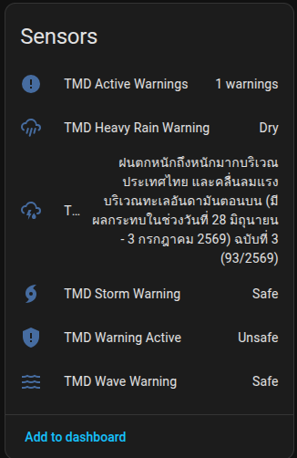
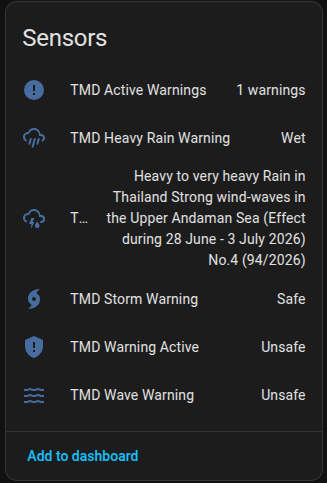

# Thailand Weather Alerts (TMD) <br> Integration for Home Assistant

A custom Home Assistant integration that fetches real-time weather warnings from the **[Thailand Meteorological Department (TMD)](https://tmd.go.th)** Weather Warning API and exposes them as entities inside Home Assistant.

> **Unofficial integration.** Not affiliated with or endorsed by the Thai Meteorological Department. During severe weather, always follow official government announcements.

---

## Features

- **Active warning count sensor** — number of currently issued warnings
- **Latest warning sensor** — title and full text of the most recent warning
- **Warning active binary sensor** — `ON` whenever any warning is in effect
- **Storm warning binary sensor** — `ON` for tropical storms, typhoons, cyclones
- **Heavy rain warning binary sensor** — `ON` for heavy rain, flash flood, or accumulation advisories
- **Wave warning binary sensor** — `ON` for strong wind-wave advisories on the Andaman Sea or Gulf of Thailand
- All entities grouped into a single **TMD device** in the device registry
- Automatic refresh every **10 minutes**
- Uses the official TMD REST API — no web scraping

---

## Requirements

- Home Assistant 2023.1 or newer
- Internet access to reach `data.tmd.go.th`
- No additional Python packages required (uses HA's built-in `aiohttp`)

---

## Installation

### HACS (recommended)

1. Open HACS → **Integrations** → three-dot menu → **Custom repositories**
2. Add `https://github.com/simplemice/tmd_alerts` with category **Integration**
3. Search for **Thailand Weather Alerts** and install
4. Restart Home Assistant

### Manual

1. Copy the `tmd_alerts` folder into your `config/custom_components/` directory:
   ```
   config/
   └── custom_components/
       └── tmd_alerts/
           ├── __init__.py
           ├── api.py
           ├── binary_sensor.py
           ├── config_flow.py
           ├── const.py
           ├── coordinator.py
           ├── manifest.json
           ├── sensor.py
           ├── strings.json
           └── translations/
               └── en.json
   ```
2. Restart Home Assistant

---

## Configuration

1. Go to **Settings → Devices & Services → Add Integration**
2. Search for **Thailand Weather Alerts (TMD)**
3. In the setup form:
   - **API User ID** — leave as `demo` to use the public account
   - **API Key** — leave as `demokey` to use the public account
4. Click **Submit**

The integration validates the credentials against the live API before saving.

### Using your own API key

The demo account is shared and subject to TMD rate limits. For personal or production use, register for a free API key at:

```
http://data.tmd.go.th/api/index1.php
```

After registration enter your `uid` and `ukey` in the config form.

---

## Entities

All entities belong to the **Thailand Weather Alerts (TMD)** device.

### Sensors

| Entity ID | Name | State | Notes |
|-----------|------|-------|-------|
| `sensor.tmd_active_warnings` | TMD Active Warnings | Number of active warnings | Unit: `warnings` |
| `sensor.tmd_latest_warning` | TMD Latest Warning | Title of most recent warning (English) | See attributes below |

#### `sensor.tmd_latest_warning` attributes

| Attribute | Description |
|-----------|-------------|
| `headline` | One-sentence summary of the warning |
| `description` | Full warning text |
| `effect_start` | Date/time the warning takes effect |
| `effect_end` | Date/time the warning expires |
| `announce_date` | Date/time the warning was issued |
| `url` | Link to the official PDF advisory |
| `contact` | TMD contact information |

#### `sensor.tmd_active_warnings` attributes

| Attribute | Description |
|-----------|-------------|
| `warnings` | List of all active warnings (each with title, headline, description, dates, URL) |

### Binary Sensors

| Entity ID | Name | Device Class | Turns ON when |
|-----------|------|--------------|---------------|
| `binary_sensor.tmd_warning_active` | TMD Warning Active | `safety` | Any warning is active |
| `binary_sensor.tmd_storm_warning` | TMD Storm Warning | `safety` | Title/headline contains: *storm, tropical, typhoon, cyclone, depression* |
| `binary_sensor.tmd_heavy_rain_warning` | TMD Heavy Rain Warning | `moisture` | Title/headline contains: *heavy rain, very heavy rain, flash flood, flood, heavy to very heavy* |
| `binary_sensor.tmd_wave_warning` | TMD Wave Warning | `safety` | Title/headline contains: *wave, wind-wave, strong wind, andaman, gulf* |

---

## Screenshots

 

---

## Data Source

| Item | Value |
|------|-------|
| API | `http://data.tmd.go.th/api/WeatherWarningNews/v2/` |
| Format | XML |
| Update interval | Every 10 minutes |
| Language | Thai and English (integration uses English fields) |
| Authentication | `uid` + `ukey` query parameters |

The TMD issues weather advisories when hazardous conditions are expected: heavy rainfall, tropical systems, strong wind-waves on coastal waters, and flash flood risk. Advisories typically cover multi-day periods and are updated once or twice daily.

---

## Automations

### Notify when any warning is issued

```yaml
automation:
  - alias: "TMD warning notification"
    trigger:
      - platform: state
        entity_id: binary_sensor.tmd_warning_active
        to: "on"
    action:
      - service: notify.mobile_app_your_phone
        data:
          title: "TMD Weather Warning"
          message: "{{ states('sensor.tmd_latest_warning') }}"
```

### Critical storm alert with details

```yaml
automation:
  - alias: "TMD storm alert"
    trigger:
      - platform: state
        entity_id: binary_sensor.tmd_storm_warning
        to: "on"
    action:
      - service: notify.mobile_app_your_phone
        data:
          title: "Storm Warning Active"
          message: >
            {{ state_attr('sensor.tmd_latest_warning', 'headline') }}
            Valid: {{ state_attr('sensor.tmd_latest_warning', 'effect_start') }}
            to {{ state_attr('sensor.tmd_latest_warning', 'effect_end') }}
```

### Dashboard card

```yaml
type: entities
title: Thailand Weather
entities:
  - entity: binary_sensor.tmd_warning_active
  - entity: binary_sensor.tmd_heavy_rain_warning
  - entity: binary_sensor.tmd_storm_warning
  - entity: binary_sensor.tmd_wave_warning
  - entity: sensor.tmd_active_warnings
  - entity: sensor.tmd_latest_warning
```

---

## Troubleshooting

**Integration fails to set up**
- Verify internet access: `curl "http://data.tmd.go.th/api/WeatherWarningNews/v2/?uid=demo&ukey=demokey"`
- Check Home Assistant logs for errors from `custom_components.tmd_alerts`

**Entities show `unavailable`**
- The TMD API may be temporarily unreachable. The coordinator retries automatically on the next update cycle (10 minutes).

**All binary sensors stay `OFF`**
- This is correct behaviour when TMD has no active warnings. Thailand's weather warning system only issues advisories during actual hazardous conditions.

**Warning text is in Thai**
- The integration reads English fields from the API. If `TitleEnglish` or `HeadlineEnglish` fields are empty in the API response, the entity state may appear blank. This occasionally happens during rapid re-issues of an advisory.

---

## Architecture

```
TMDCoordinator (DataUpdateCoordinator)
│   Polls API every 10 minutes via aiohttp
│   Parses XML with xml.etree.ElementTree
│
├── sensor.py
│   ├── TMDWarningCountSensor   (native_value = len(warnings))
│   └── TMDLatestWarningSensor  (native_value = title_en of warnings[0])
│
└── binary_sensor.py
    ├── TMDWarningActiveSensor  (is_on = bool(warnings))
    ├── TMDStormWarningSensor   (is_on = keyword match)
    ├── TMDHeavyRainSensor      (is_on = keyword match)
    └── TMDWaveWarningSensor    (is_on = keyword match)
```

All entities inherit `CoordinatorEntity` and update automatically when the coordinator fetches new data.

---

## License

MIT — see [LICENSE](LICENSE).
